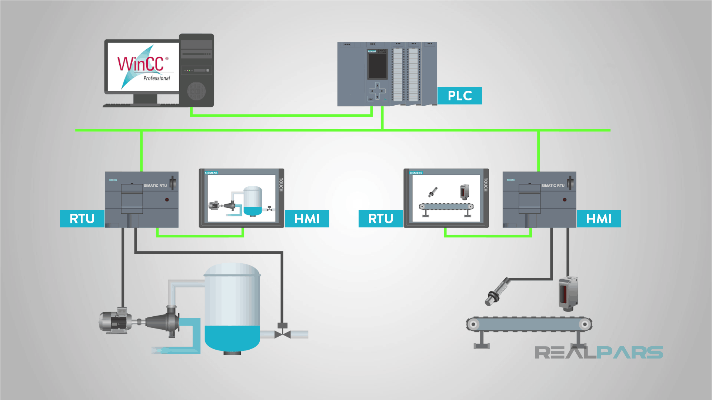
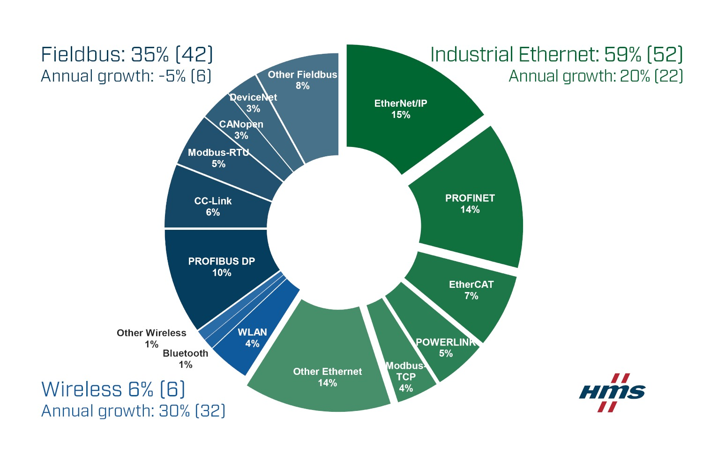
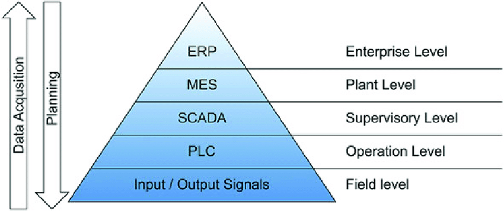
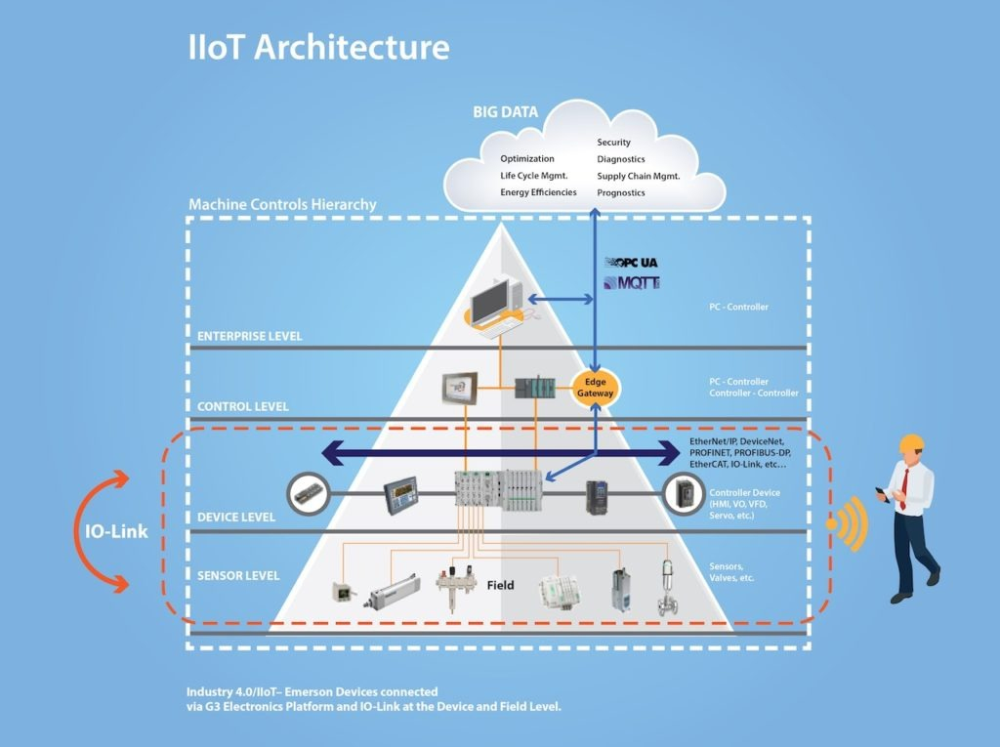

# Production Supporting Systems in Factories

## ระบบสนับสนุนการผลิตในโรงงานอุตสาหกรรม

---

# Summary

---

# SCADA

- A system of software and hardware elements that allows industrial organizations to:
  - **Control** industrial processes locally or at remote locations
  - Directly **interact** with devices such as sensors, valves, pumps, motors, and more through human-machine interface (HMI) software
  - **Monitor**, gather, and process real-time data
  - **Record** events into a permanent storage.

---

# Architecture

- **PLC** (Programmable Logic Controller) and/or **RTU** (Remote Terminal Units)
- **HMI** (Human Machine Interface)
- **Field devices** - sensors and actuators
- **SCADA computer**

---

# Protocol

[Source](https://www.fluke.com/en-us/learn/blog/electrical/industrial-ethernet)

---

# Comparison to SCADA components

| Component  | Function            | SCADA Equiv.   |
| ---------- | ------------------- | -------------- |
| `Node-Red` | Collect data        | PLC / RTU      |
|            | Display data        | SCADA computer |
|            | Notify to `Line`    | SCADA computer |
|            | Write to `Database` | SCADA computer |

---

# Comparison to SCADA components

| Component      | Function      | SCADA Equiv.  |
| -------------- | ------------- | ------------- |
| `Mobile phone` | Output Sensor | Field devices |
|                | Touch screen  | HMI           |

---

# Protocol used in the project

- HTTP
- MQTT

---

# IIot

- The Industrial Internet of Things (IIoT)
- Internet of Things (IoT) in industrial environments.
  - It includes the collection of data from smart connected equipment, sensors, actuators, and systems.

---

# Why

### Hierarchical model of an industrial automation

[Source](https://www.researchgate.net/figure/Hierarchical-model-of-an-industrial-automation-pyramid-based-on-field-level-sensing-The_fig1_352116876)

---

# IIot

[Source](https://www.controleng.com/articles/iiot-ready-technologies-improve-machine-controls/)

---

# Benefits

- เพิ่มประสิทธิภาพการสื่อสารการวางแผนการทำงานในโรงงานอุตสาหกรร
  - ยืดหยุ่น
  - ประหยัดเวลา
- หลีกเลี่ยงการ Downtime
  - การบำรุงรักษาที่คาดการณ์ล่วงหน้า (Predictive maintenance)
  - การตรวจสถานะของเครื่องจักร (Monitor)
